# Hive/Hadoop practice

## Background

Hands-on exposure to Hive and the Hadoop ecosystem (HDFS, YARN, distributed querying), built through a self-directed practice environment rather than prior job experience with it.

Single-node Hadoop cluster on Google Cloud Dataproc, Hive on top of HDFS/YARN, everything run through the Hive CLI. Screenshots below are raw terminal output.

## Schema

Two tables, `employees` and `departments`, joined on department name.

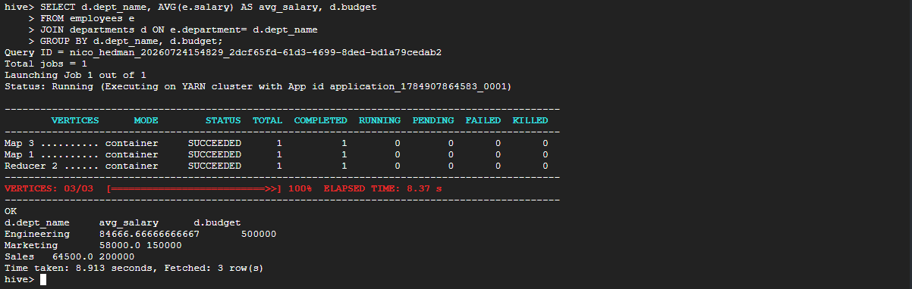

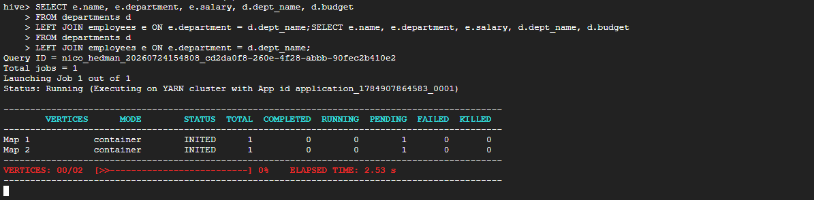

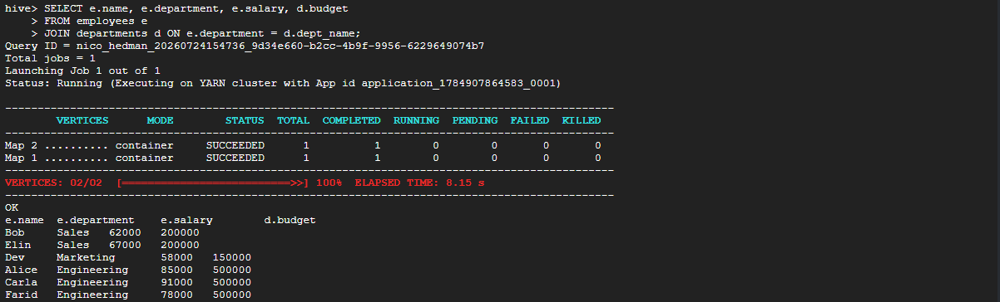

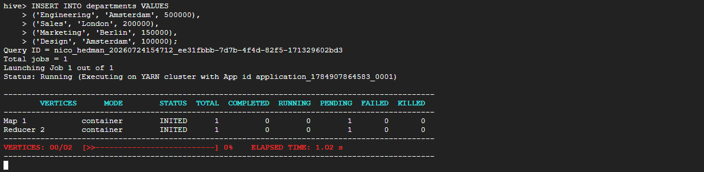

Even a small insert triggers a full Map/Reduce job under YARN. Hive queries are distributed jobs, not simple writes.

## Joins

Inner join, employees to department budget:

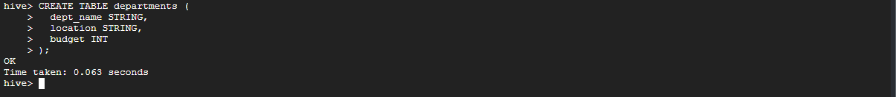

Left join, departments as the base table. Every department is kept, including one with no employees (NULL for its employee columns):

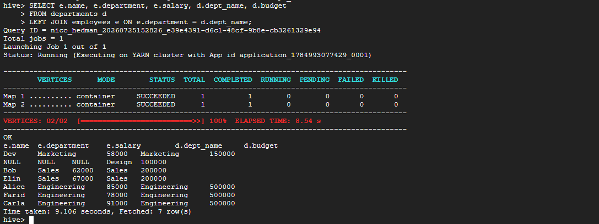

Table order matters here: whichever table follows `FROM` is preserved in full.

## Aggregation

Average salary per department, grouped with budget:

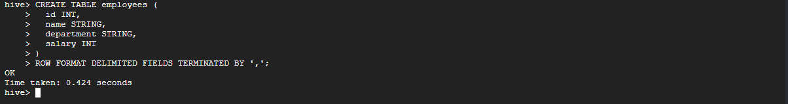

Any selected column not wrapped in an aggregate function has to be in `GROUP BY`. Otherwise Hive has no single value to display once rows collapse into groups.

## Partitioning

Splits a table into separate physical folders by a chosen column, so a filtered query only scans the relevant folder instead of the whole table.

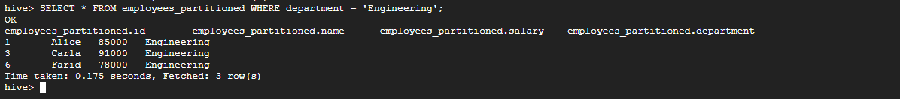

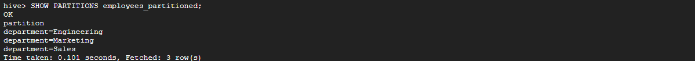

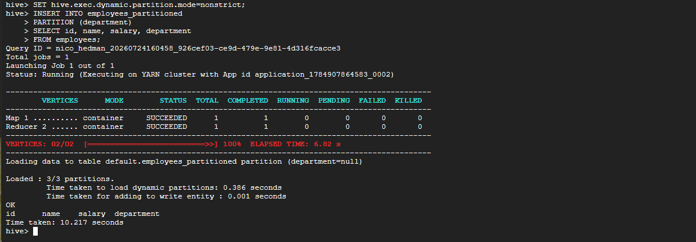

Three partitions, one per department. The data was physically split, not just grouped in a query.

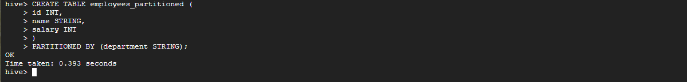

Filtering on `department = 'Engineering'` returns only the matching rows, with department reconstructed from the folder name rather than stored in the row itself.

## Limitations

- Small practice dataset, not production scale. Partitioning has no real performance payoff here. The point was understanding the mechanism, not benchmarking it.
- `EXPLAIN`/`EXPLAIN EXTENDED` didn't show a clean partition-pruning plan at this size. There's not enough data for the optimizer to do anything interesting with.
- Cluster setup itself involved real troubleshooting: zone capacity errors, a disk quota limit, Cloud Resource Manager API permissions. Resolved along the way.

## Takeaway

Joins (inner and left), aggregation, and partitioning: the core querying concepts that carry over from Hive to any SQL-on-Hadoop engine (Presto, Spark SQL).
